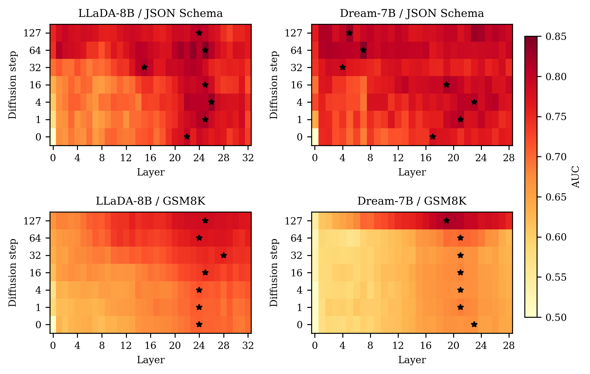
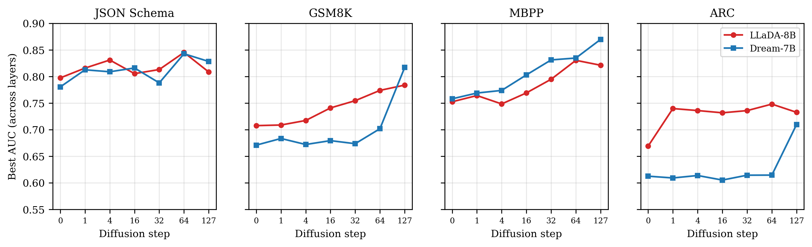

# Probing Functional Correctness in Diffusion Language Models

Accepted to ACL 2026 SRW. 🎉

First probing study of diffusion language model (DLM) hidden states. Linear classifiers on intermediate denoising steps predict whether outputs will be functionally correct.

## Key Findings

1. **Correctness signal emerges across denoising steps** (+0.08-0.11 AUC on reasoning tasks). Unlike AR models, DLMs accumulate additional signal through iterative refinement on GSM8K, MBPP, and ARC.
2. **Step-0 signal is prompt difficulty, not diffusion-specific** (AUC 0.61-0.80). Initial hidden states already carry above-chance correctness information, comparable to AR probes on the same prompt.
3. **Task-dependent emergence patterns.** Structural tasks (JSON) remain flat (~0.80 from step 0), reasoning tasks show gradual buildup (0.08-0.11 AUC gain).
4. **Distinct layer dynamics.** LLaDA concentrates signal in upper layers (L22-28). Dream migrates from upper to lower layers on JSON schema.
5. **Offline filtering avoids wasted compute.** Per-step probe confidence identifies likely failures, skipping 36-98% of generations depending on task.

## Models

| Key | Model | Layers |
|---|---|---|
| `llada` | GSAI-ML/LLaDA-8B-Instruct | 33 |
| `dream` | Dream-org/Dream-v0-Instruct-7B | 29 |

## Datasets

| Key | Source | N | Gen length | Correctness check |
|---|---|---|---|---|
| `jsonschema` | eth-sri/json-mode-eval-extended | 272 | 256 | JSON parse + reference match |
| `gsm8k` | openai/gsm8k (test) | 1,319 | 512 | Numeric answer match |
| `mbpp` | google-research-datasets/mbpp (sanitized test) | 257 | 256 | Code execution + test assertions |
| `arc` | allenai/ai2_arc (ARC-Challenge test) | 1,172 | 256 | Answer letter match |

## Results

### AUC heatmaps (layer x step)

Stars mark the best layer per step. JSON schema shows strong signal from step 0 (flat emergence), while GSM8K shows gradual buildup. Dream's best layer migrates from upper to lower layers on JSON schema.



### AUC vs. denoising step

Best AUC across layers at each step. JSON schema is flat (~0.80 from step 0), while GSM8K, MBPP, and ARC rise gradually.



## Method

- **Probe:** PCA(64) + StandardScaler + LogisticRegression, 5-fold stratified CV
- **Steps:** 7 checkpoints (0, 1, 4, 16, 32, 64, 127) during 128-step denoising
- **Regions:** Generation region split into 4 equal-length position regions, mean-pooled
- **Metric:** AUC (control probes on shuffled labels yield ~0.50)

## Scripts

Scripts are organized by purpose:
- `src/core/` — Main experiments and baselines
- `src/ablations/` — Length, region, std ablations
- `src/applications/` — Early exit, seed rerank, rebuttal
- `src/utils/` — Data processing and result comparison

**Core experiments:**
```bash
.venv/bin/modal run src/core/modal_midstep_probe.py --dataset jsonschema --model llada --chunks 8
.venv/bin/modal run src/core/modal_ar_probe.py --dataset jsonschema --chunks 4
.venv/bin/modal run src/core/modal_baseline_probes.py --baseline-type shuffle --dataset gsm8k
```

**Ablations:**
```bash
.venv/bin/modal run src/ablations/modal_length_ablation_probe.py --dataset arc --mode output_matched
.venv/bin/modal run src/ablations/modal_region_ablation.py --dataset jsonschema --model llada
.venv/bin/modal run src/ablations/modal_probe_with_std.py --dataset gsm8k --model dream
```

**Applications:**
```bash
.venv/bin/modal run src/applications/modal_early_exit_sim.py --dataset jsonschema
.venv/bin/modal run src/applications/modal_seed_rerank.py --dataset gsm8k --model llada
```
